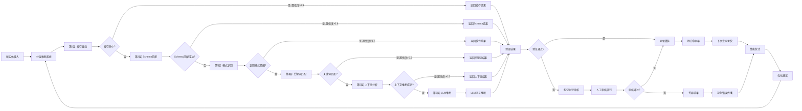
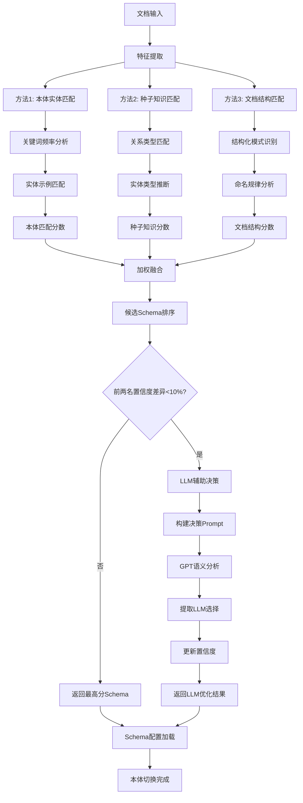
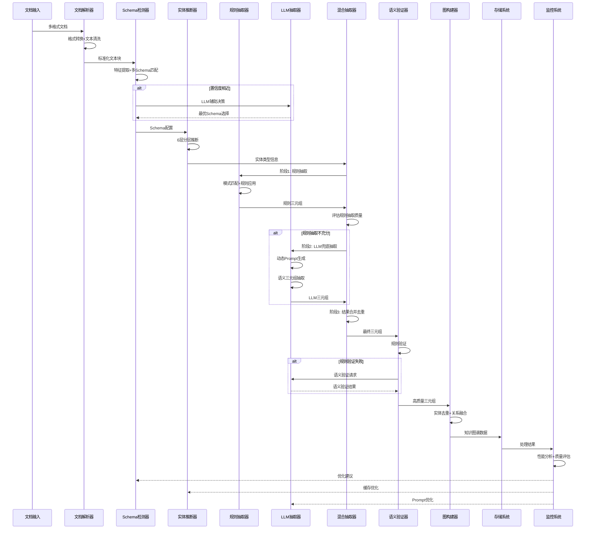

# 多领域知识图谱构建系统完整流程图

## 🏗️ **系统总体架构图**

```mermaid
graph TB
    subgraph "文档输入层"
        A1[多格式文档] --> A2[格式解析器]
        A2 --> A3[文本清洗器]
        A3 --> A4[智能分块器]
        A4 --> A5[标准文本块]
    end
    
    subgraph "Schema检测与本体适配层"
        B1[Schema检测器] --> B2[特征提取器]
        B2 --> B3[多Schema匹配器]
        B3 --> B4{置信度差异<10%?}
        B4 -->|是| B5[LLM辅助决策]
        B4 -->|否| B6[最优Schema选择]
        B5 --> B6
        B6 --> B7[本体管理器]
        B7 --> B8[领域词库构建器]
        B8 --> B9[Schema配置]
    end
    
    subgraph "智能推断层"
        C1[6层分层推断器] --> C2[第1层: 缓存查找]
        C2 --> C3{缓存命中?}
        C3 -->|是| C4[返回缓存结果]
        C3 -->|否| C5[第2层: Schema匹配]
        C5 --> C6{Schema匹配成功?}
        C6 -->|是| C7[返回Schema类型]
        C6 -->|否| C8[第3层: 模式匹配]
        C8 --> C9{模式匹配成功?}
        C9 -->|是| C10[返回模式类型]
        C9 -->|否| C11[第4层: 关键词匹配]
        C11 --> C12{关键词匹配成功?}
        C12 -->|是| C13[返回关键词类型]
        C12 -->|否| C14[第5层: 上下文分析]
        C14 --> C15{上下文推断成功?}
        C15 -->|是| C16[返回上下文类型]
        C15 -->|否| C17[第6层: 标记为Unknown]
        C4 --> C18[实体类型结果]
        C7 --> C18
        C10 --> C18
        C13 --> C18
        C16 --> C18
        C17 --> C18
    end
    
    subgraph "混合三元组抽取层"
        D1[混合抽取器] --> D2[阶段1: 规则抽取]
        D2 --> D3[规则模式匹配]
        D3 --> D4[生成规则三元组]
        D4 --> D5{规则抽取充分?}
        D5 -->|是| D6[返回规则结果]
        D5 -->|否| D7[阶段2: LLM兜底抽取]
        D7 --> D8[动态Prompt生成]
        D8 --> D9[LLM三元组抽取]
        D9 --> D10[阶段3: 结果合并去重]
        D6 --> D11[最终三元组结果]
        D10 --> D11
    end
    
    subgraph "语义验证与质量控制层"
        E1[规则验证引擎] --> E2[本体约束检查]
        E2 --> E3[类型验证器]
        E3 --> E4{规则验证通过?}
        E4 -->|是| E5[语义一致性检查]
        E4 -->|否| E6[LLM语义验证器]
        E5 --> E7[质量评分系统]
        E6 --> E7
        E7 --> E8{质量分数>阈值?}
        E8 -->|是| E9[高质量三元组]
        E8 -->|否| E10[标记待审核]
    end
    
    subgraph "知识图谱构建与存储层"
        F1[实体去重器] --> F2[编辑距离计算]
        F2 --> F3[语义相似度分析]
        F3 --> F4[关系融合器]
        F4 --> F5[冲突解决器]
        F5 --> F6[图结构构建器]
        F6 --> F7[索引优化器]
        F7 --> F8[增量更新管理器]
        F8 --> F9[知识图谱数据库]
    end
    
    subgraph "实时监控与反馈层"
        G1[性能监控器] --> G2[指标收集器]
        G2 --> G3[质量评估器]
        G3 --> G4[异常检测器]
        G4 --> G5[反馈学习器]
        G5 --> G6[系统优化建议]
    end
    
    subgraph "KAG兼容层"
        H1[标准化接口] --> H2[数据格式转换器]
        H2 --> H3[KAG SDK适配器]
        H3 --> H4[增量更新管理器]
        H4 --> H5[外部系统集成]
    end
    
    %% 数据流连接
    A5 --> B1
    B9 --> C1
    B9 --> D1
    C18 --> D1
    D11 --> E1
    E9 --> F1
    F9 --> G1
    F9 --> H1
    G6 --> B1
    G6 --> C1
    G6 --> D1
    E10 --> G3
```

## 🔍 **智能推断层详细流程图**

## 📊 **Schema检测详细流程图**

## 🔄 **数据流转详细图**

## 🎯 **关键决策点说明**

### **Schema检测决策点**
- **置信度阈值**: 10%差异作为LLM介入阈值
- **特征权重**: 本体匹配40% + 种子知识30% + 文档结构30%
- **LLM触发条件**: 前两名Schema置信度相近时
- **LLM模式**: 支持API模式和模拟模式，自动降级

### **实体推断决策点**
- **第1层-缓存查找**: 置信度>阈值直接返回，避免重复计算
- **第2层-Schema匹配**: 基于本体定义的精确匹配，置信度0.9
- **第3层-模式匹配**: 基于正则表达式的命名规律识别，置信度0.8
- **第4层-关键词匹配**: 基于领域词汇的类型推断，置信度0.7
- **第5层-上下文分析**: 基于语义环境的类型推断，置信度0.6
- **第6层-未知标记**: 所有层都失败时标记为Unknown，不调用LLM

### **质量控制决策点**
- **规则验证优先**: 先进行快速规则验证
- **语义验证兜底**: 规则失败时使用LLM语义验证
- **质量分数阈值**: 综合评分决定是否接受三元组

这个完整的流程图展示了系统的每个细节，包括决策逻辑、数据流转和优化反馈机制。
